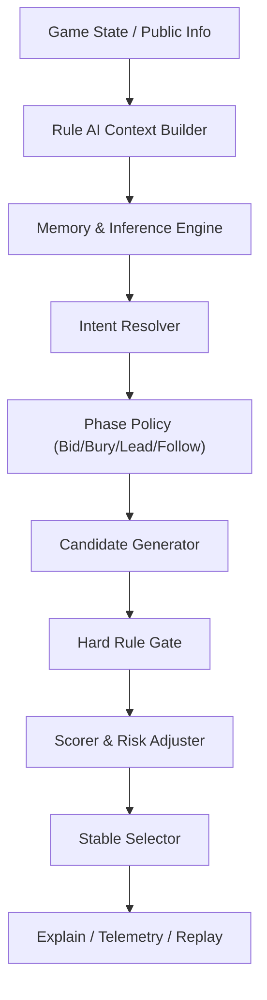

# 规则AI架构设计 v2.1

## 1. 文档定位
- 状态：正式设计文档
- 版本：v2.1
- 日期：2026-03-15
- 适用范围：当前项目规则AI、亮主AI、埋底AI、甩牌AI、后续与RL衔接的规则先验层

本文件是当前项目规则AI的正式架构基线，用于指导：
- 需求收敛
- 模块拆分
- 参数设计
- 解释日志
- 验收测试

说明：
- `doc/tractor_rule_ai_design V2.md` 仅作为参考材料，不作为本项目正式设计和验收基线。
- 本文档的规则口径以 [80分_拖拉机游戏规则文档_v1.4](./80分_拖拉机游戏规则文档_v1.4.md) 和当前项目代码中的规则校验器为准。

## 2. 设计目标
规则AI 2.1 的目标不是“更会出合法牌”，而是“在严格合法前提下，按局势和意图稳定做出更像熟练玩家的决策”。

具体目标：
- 严格遵守项目冻结规则，禁止绕过 `PlayValidator / FollowValidator / ThrowValidator / TrickJudge`
- 支持亮主、埋底、首发、跟牌、甩牌的统一决策框架
- 让 AI 的行为具备“主意图 + 副意图 + 代价意识 + 风险意识”
- 用统一参数驱动不同难度，而不是维护多套分叉逻辑
- 每次决策都可解释、可记录、可复盘
- 后续可作为 RL 的 warm start、规则先验和约束层

## 3. 非目标
本阶段不包含以下内容：
- 不引入全局博弈搜索或蒙特卡洛树搜索
- 不直接实现神经网络策略
- 不在规则层偷看对手手牌
- 不把概率推断包装成确定信息
- 不把参考文档中的抽象状态字段原样搬入代码

## 4. 参考输入
本设计主要吸收以下文档中的有效部分：
- [tractor_rule_ai_design V2](./tractor_rule_ai_design%20V2.md)：参考其“三层决策”和“硬规则优先”的组织方式
- [AI记牌系统设计文档_v1.3](./AI记牌系统设计文档_v1.3.md)：参考其记牌、缺门、甩牌安全评估能力
- [规则AI甩牌策略_v1.0](./规则AI甩牌策略_v1.0.md)：参考其组件化甩牌判定与安全阈值
- [AI策略设计文档](./AI策略设计文档.md)：参考其基础打法经验，但不直接作为实现规范

吸收后保留的核心思想：
- 规则强约束优先于策略偏好
- 决策要分层，但不能脱离当前代码结构
- 状态要足够支撑决策，但不能为了“看起来完整”塞入大量无效字段
- 行为必须可解释、可回放

## 5. 当前代码基线
规则AI 2.1 不是从零重写，而是在现有模块上演进。

当前主要落点：
- `src/Core/AI/AIPlayer.cs`
  - 当前是统一入口，已经区分 `Lead` 和 `Follow`
  - 负责候选生成、简单启发式选择、难度扰动
- `src/Core/AI/CardMemory.cs`
  - 当前支持已出牌记录、缺门记录、无对子证据、甩牌安全评估
- `src/Core/AI/Bidding/BidPolicy.cs`
  - 当前已实现亮主/反主决策，具备分阶段和“碰运气”参数
- `src/Core/Rules/PlayValidator.cs`
- `src/Core/Rules/FollowValidator.cs`
- `src/Core/Rules/ThrowValidator.cs`
- `src/Core/Rules/TrickJudge.cs`
  - 以上模块是规则真值源，AI 不得绕开

2.0 的重点不是替换上述规则模块，而是把 AI 层组织成更清晰的“状态 -> 意图 -> 候选 -> 评分 -> 选择”架构。

## 6. 架构总览
规则AI 2.1 分为 6 个层次：

1. 规则与配置层
2. 状态组装层
3. 记牌与推断层
4. 意图与阶段决策层
5. 候选生成与评估层
6. 解释与日志层



统一优先级：
`HardRule > PhaseIntent > RiskControl > EvaluationScore > StableTieBreak`

## 7. 分层职责
### 7.1 规则与配置层
职责：
- 冻结本局规则口径
- 向 AI 暴露合法动作边界
- 统一难度、风格、风险、阈值参数

输入来源：
- `GameConfig`
- 当前局面公开规则状态
- 难度预设和每局风格扰动值

输出对象：
- `RuleProfile`
- `DifficultyProfile`
- `StyleProfile`

约束：
- 一局开始后，`RuleProfile` 不允许在局中变化
- `DifficultyProfile` 允许按难度预设读取，但不允许根据对手手牌作弊修正

### 7.2 状态组装层
职责：
- 从 `Game / AIPlayer / CardMemory` 组装出 AI 真正可用的决策上下文
- 统一处理“公开信息 / 私有信息 / 推断信息 / 阶段标签”

建议输出 `RuleAIContext`，至少包含：
- `MyHand`
- `LegalActions`
- `TrumpInfo`
- `RoundInfo`
- `ScoreInfo`
- `RoleInfo`
- `VisibleBottomInfo`
- `CurrentTrickInfo`
- `MemorySnapshot`
- `InferenceSnapshot`
- `RiskBudget`
- `PhaseKind`

### 7.3 记牌与推断层
职责：
- 维护确定信息
- 维护结构信息
- 维护风险信息

必须区分三类信息：

1. 确定信息
- 哪些牌已经出过
- 哪家已经缺哪门
- 哪家在某体系下已暴露“无对子/无对应拖拉机”的硬证据
- 庄家可见底牌

2. 结构信息
- 某玩家某体系大概率没有更大对子
- 某玩家主力厚度估计
- 某门仍可能存在多长拖拉机
- 某门是否仍可能被甩

3. 风险信息
- 某门再首发被毙风险
- 某甩牌的安全等级
- 当前队友领先是否稳
- 某墩反超后是否可能被后位再次压制

约束：
- 确定信息只能从规则强约束推出
- 概率信息不能在日志或执行中伪装成确定事实
- 简单难度可以降级关闭部分推断，但结构必须一致

### 7.4 意图与阶段决策层
职责：
- 不直接选牌，只决定当前阶段和本回合的“主意图”
- 控制 AI 行为方向，而不是替代合法性和评分器

要求：
- 每次决策最多 1 个主意图 + 1 个副意图
- 意图必须带触发条件和退出条件

建议的通用主意图：
- `TakeScore`：抢分
- `ProtectBottom`：保底，降低被抠底和掉庄风险
- `SaveControl`：保大/保控制权
- `PassToMate`：送分给队友
- `ForceTrump`：逼主
- `ShapeHand`：清副牌/做短门
- `PreserveStructure`：保对子/保拖拉机/保结构
- `TakeLead`：争牌权
- `MinimizeLoss`：止损
- `PrepareEndgame`：控末墩/布局最后几墩

要求：
- `PreserveStructure` 替代旧的“保拖拉机”，范围更清晰
- `PrepareEndgame` 只在后期高权重触发，不与普通中期意图等价竞争

### 7.5 候选生成与评估层
职责：
- 先生成合理候选，再打分，不允许对整个动作空间无差别爆搜
- 对不同阶段使用不同候选生成器

阶段拆分：
- `BidPolicy2`：亮主/反主
- `BuryPolicy2`：埋底
- `LeadPolicy2`：首发
- `FollowPolicy2`：跟牌

统一流程：
1. 候选生成
2. 合法性校验
3. 去重与结构归一化
4. 意图筛选
5. 评分
6. 风险修正
7. 稳定 tie-break

### 7.6 解释与日志层
职责：
- 记录 AI “为什么这么打”
- 让调试、回放、训练数据生成共享同一份解释信息

每次决策至少输出：
- `phase_policy`
- `primary_intent`
- `secondary_intent`
- `candidate_count`
- `top3_candidates`
- `top3_scores`
- `chosen_action`
- `hard_rule_rejects`
- `risk_flags`
- `selected_reason`

## 8. 阶段化架构
### 8.1 亮主/反主阶段
目标：
- 决定是否亮主
- 决定亮哪门
- 决定是确定亮还是风格化提前亮

沿用现有 `BidPolicy` 的有效部分：
- 发牌阶段分早中后期
- 根据主牌占比、对子、拖拉机、王、级牌估值
- 每局存在 0.1~0.3 的风格化“碰运气”概率

2.0 增补：
- 把 `BidPolicy` 纳入统一 `PhasePolicy`
- 与埋底和打牌期共享 `HandProfile`
- 增加亮主解释字段，如：
  - `bid_strength_score`
  - `bid_reason_codes`
  - `used_luck`
  - `estimated_trump_density`

### 8.2 埋底阶段
目标：
- 不只是“丢八张”，而是围绕整局计划塑形手牌

建议埋底主意图：
- `ProtectBottom`
- `PreserveTrump`
- `PreserveStructure`
- `CreateVoid`
- `DumpRiskPoints`

评分要素：
- 主牌保留
- 分牌保护
- 结构保留
- 做短门收益
- 被抠底风险

约束：
- 不能为了造短门把整局控制力埋没
- 不能只按“最小分值”埋底，必须看结构和主力

### 8.3 首发阶段
目标：
- 决定这一墩要打成什么类型
- 通过首发拿到节奏收益，而不是只看当前墩输赢

建议首发主意图：
- `ForceTrump`
- `AttackLongSuit`
- `ProbeWeakSuit`
- `PrepareThrow`
- `TakeLead`
- `PrepareEndgame`

首发候选分类：
- 单张试探
- 对子试探
- 拖拉机推进
- 长门推进
- 主牌抽主
- 安全甩牌
- 高收益风险甩牌

约束：
- 首发前必须先过 `PlayValidator`
- 混合甩牌必须经过 `ThrowValidator` 和记牌安全评估
- 首发评估要显式计算“下一手牌权价值”

### 8.4 跟牌阶段
目标：
- 在硬规则强约束下做最优响应

建议跟牌模式：
- `MateWinningSecure`：队友已稳赢，送分或保资源
- `MateWinningFragile`：队友暂时领先，但仍需保底
- `OpponentWinningCheapOvertake`：低成本精确反超
- `OpponentWinningTooExpensive`：止损
- `HighScoreOrEndgame`：高分墩/末墩允许激进

跟牌评估必须考虑：
- 当前赢家是否可信
- 反超后是否会被后位再次压过
- 这墩分数是否值得投入
- 是否会拆关键结构
- 是否会提前暴露短门或高主

约束：
- 跟牌合法性完全服从 `FollowValidator`
- 缺门后是否用主牌毙，必须显式判断“结构是否完整、赢面是否足够、代价是否合理”
- 非主首引时，只有“该门完全断门后整手以主牌对应压制”才允许把主牌视为有效争胜结构
- 若已跟出部分首引花色，剩余位置再混入主牌，只属于合法跟牌中的“垫/毙牌补缺”，不得把整手错误视为可赢结构
- 因此 AI 在评估“当前赢家是否可信”时，必须区分：
  - `完整同门压制`
  - `完整主牌毙牌`
  - `部分同门 + 主牌补缺`
- 其中第 3 类只能视为合法响应，默认不能作为 `TrickJudge` 意义上的有效反超

### 8.5 末墩控制阶段
目标：
- 在最后 1~3 墩进入专门的残局模式
- 解决“平时打得对，但最后几墩资源分配错误”的问题

进入条件建议：
- `CardsLeftMin <= 8` 时进入后期
- `CardsLeftMin <= 5` 时进入强残局

残局核心子目标：
- `ProtectBottom`：避免对手抠底或扩大底分
- `SecureLastTrick`：争取自己或队友拿最后一墩
- `PreserveLastControlTrump`：保留最后的控制主牌
- `AvoidPointLeak`：减少高分牌裸送

残局决策要点：
- 中间小分墩可以主动放弃，换取最后一墩控制
- 若本方已接近胜线，优先保底，不为小分抢大资源
- 若对方接近抠底窗口，优先保留能断最后一墩的主牌或结构
- 若本方有强主对子或主拖，应明确判断是否保留到最后一墩
- 若庄家埋底分高，应提高“最后一墩不能失守”的权重
- 若本局一旦被抠底可能掉庄，`ProtectBottom` 可临时提升为残局超级意图

末墩抠底/保底判定（新增）：
- 先计算已出的所有分数牌：若 `RemainingScoreTotal == 0`，判定“分数已出完”，末墩不再为抠底强行消耗资源
- 闲家抠底意图触发：
  - `DefenderScore + RemainingScoreTotal >= 80`，说明“剩余分 + 已得分足够赢”，进入抠底争夺
  - 若 `DefenderScore + RemainingScoreTotal < 80` 但 `DefenderScore + RemainingScoreTotal + BottomPoints(估算或可见) >= 80`，
    说明“需要双扣/多倍扣底才能赢”，提升为强制抠底
- 抠底出牌优先级（在“可赢/可压”的候选中排序）：
  - 拖拉机 > 多对子 > 单对子 > 单牌
- 庄家保底意图触发：
  - 底牌可见时（庄家视角），若“已得分 + 底分被扣后可能掉庄”，提升 `ProtectBottom`
  - 若 `DefenderScore + RemainingScoreTotal >= 80`，说明闲家有潜在胜线，应提前转入保底
- 庄家队友协同：
  - 通过庄家在末段出牌中的 `ProtectBottom / PrepareEndgame` 意图识别保底倾向
  - 若庄家保底意图成立，队友在末段优先协助防守底分，而非抢小分

约束：
- `PrepareEndgame` 在后期具有高优先级，但不能绕过合法性校验
- 后期模式不等于“任何墩都激进”，而是更重视最后一墩与底分风险

## 9. 统一状态模型
建议在 AI 层引入以下数据对象。

状态模型约束：
- 这里定义的是目标态，不要求 M1 一次性引入全部字段
- 实施时按“先必要、后增强”的顺序渐进落地
- 若某字段在当前阶段既不参与决策、也不参与解释日志，则暂不进入正式上下文对象

推荐分三层落地：
- `M1最小集`：足以支撑统一入口、合法性、解释日志
- `M2增强集`：足以支撑跟牌评分和基础推断
- `M3/M4扩展集`：足以支撑甩牌安全、埋底联动、末墩控制

### 9.1 RuleProfile
作用：冻结本局规则口径

建议字段：
- `Mode`
- `TrumpSuit`
- `LevelRank`
- `ThrowFailPenalty`
- `EnableCounterBottom`
- `AllowBrokenTractor`
- `StrictFollowStructure`
- `StrictCutStructure`
- `BottomMultiplierRule`

### 9.2 HandProfile
作用：描述当前手牌形态，供亮主、埋底、首发、跟牌共享

建议字段：
- `TrumpCount`
- `HighTrumpCount`
- `JokerCount`
- `LevelCardCount`
- `TrumpPairCount`
- `TrumpTractorCount`
- `SuitLengths`
- `StrongestSuit`
- `WeakestSuit`
- `PotentialVoidTargets`
- `ScoreCardCount`
- `StructureSummary`

### 9.3 MemorySnapshot
作用：承载确定信息

建议字段：
- `PlayedCountByCard`
- `VoidSuitsByPlayer`
- `NoPairEvidence`
- `NoTractorEvidence`
- `KnownBottomCards`

### 9.4 InferenceSnapshot
作用：承载结构与风险推断

建议字段：
- `EstimatedTrumpCountByPlayer`
- `HighTrumpRiskByPlayer`
- `PairPotentialBySystem`
- `TractorPotentialBySystem`
- `ThrowSafetyEstimate`
- `LeadCutRiskBySystem`
- `MateHoldConfidence`

表示约束：
- 所有推断字段必须带置信度，不允许只给“裸值”
- 推荐统一表示为：
  - 区间型：`estimate=5, lower=3, upper=7, confidence=0.72`
  - 概率型：`probability=0.68, confidence=0.55`
  - 等级型：`level=High, confidence=0.81`
- 日志和回放中必须显式标注为 `estimated / probable / risk`，禁止显示成确定事实

建议最小表示：
- `EstimatedTrumpCountByPlayer[player] = { estimate, lower, upper, confidence }`
- `LeadCutRiskBySystem[system] = { level, confidence }`
- `MateHoldConfidence = { probability, confidence }`

### 9.5 DecisionFrame
作用：描述当前决策时刻

建议字段：
- `PhaseKind`
- `TrickIndex`
- `PlayPosition`
- `CardsLeftMin`
- `CurrentWinningPlayer`
- `PartnerWinning`
- `LeadCards`
- `CurrentWinningCards`
- `CurrentTrickScore`
- `DefenderScore`
- `BottomPoints`
- `PlayedScoreTotal`
- `RemainingScoreTotal`
- `RemainingScoreCards`
- `BottomRiskPressure`
- `DealerRetentionRisk`
- `BottomContestPressure`
- `ScorePressure`
- `EndgameLevel`

## 10. 意图系统 2.1
### 10.1 意图定义
意图不是动作模板，而是动作选择方向。

每个意图必须定义：
- 含义
- 适用阶段
- 触发条件
- 退出条件
- 允许成本
- 禁区

### 10.2 推荐意图字典
#### `SaveControl`
- 含义：保留大主、大对子、大拖拉机和后续控墩能力
- 适用：前中期、低分墩
- 允许成本：放弃低价值墩
- 禁区：关键高分墩、关键末墩

#### `TakeScore`
- 含义：当前墩分值值得抢，或必须阻止对手拿分
- 适用：中后期、高分墩、胶着比分
- 允许成本：适度拆结构和交主
- 禁区：小分墩过度投入

#### `ProtectBottom`
- 含义：优先防止对手抠底、扩大底分，或因底分失守导致庄家掉庄
- 适用：庄家方、中后期、末墩前后、底分较高或掉庄风险较高时
- 允许成本：放弃中间小分墩、保留关键主牌和结构、放缓抢分节奏
- 禁区：前期无底分压力时长期把全局都打成纯防守
- 触发条件建议：
  - `BottomPoints >= HighBottomPointsThreshold`
  - `BottomRiskPressure = High`
  - `DealerRetentionRisk = High`
  - `CardsLeftMin <= EndgameCardsThreshold`
- 典型动作：
  - 保留最后一墩控制主牌
  - 避免为小分提前交掉关键大主
  - 降低不必要的高风险甩牌和高风险抢墩
  - 若必须在“抢分”和“保底”中二选一，优先避免被抠底

#### `PassToMate`
- 含义：队友大概率稳赢时安全送分
- 适用：跟牌阶段
- 允许成本：低价值副牌、小量分牌
- 禁区：关键主牌、关键结构、领先不稳时乱送

#### `ForceTrump`
- 含义：主动抽主、压缩对手毙牌空间
- 适用：强主局、长副门预备局
- 允许成本：部分小主
- 禁区：弱主局盲目抽主

#### `ShapeHand`
- 含义：清副牌、做短门、优化后续毙牌和控墩路径
- 适用：前中期、止损墩
- 允许成本：低价值散张
- 禁区：误拆潜在强门或关键分牌保护门

#### `PreserveStructure`
- 含义：尽量保对子、拖拉机、潜在连对
- 适用：全阶段
- 允许成本：放弃低收益赢墩机会
- 禁区：高分必争、末墩必争场景

#### `TakeLead`
- 含义：为下一墩先出牌权付出合理成本
- 适用：本方下手收益高时
- 允许成本：中等资源
- 禁区：拿到牌权后无明确后续收益

#### `MinimizeLoss`
- 含义：明确此墩高成本难赢时，减少送分和资源浪费
- 适用：对手已大、后位风险高、无利可图时
- 允许成本：放弃该墩
- 禁区：高分墩和末墩机械性摆烂

#### `PrepareEndgame`
- 含义：围绕最后 1~3 墩保资源、控底、抢牌权
- 适用：后期
- 允许成本：中期部分弃墩
- 禁区：前期过早接管全局

### 10.3 意图冲突解决
同一手通常会出现多个意图同时成立，例如：
- `TakeScore` vs `PreserveStructure`
- `TakeScore` vs `ProtectBottom`
- `PassToMate` vs `TakeLead`
- `ForceTrump` vs `ShapeHand`

冲突解决原则：
1. 规则强约束优先
2. 阶段性超级意图优先于普通意图
3. 高分和底分安全优先于一般资源保留
4. 低收益争墩不得无上限吞噬结构与主控资源

建议优先级矩阵：
- `PrepareEndgame` > `ProtectBottom` > `TakeScore` > `TakeLead` > `PassToMate` > `SaveControl` > `PreserveStructure` > `ShapeHand` > `ForceTrump` > `MinimizeLoss`

说明：
- 这个顺序不是固定输出顺序，而是在冲突时用于决定“谁有最终否决权”
- `MinimizeLoss` 虽然排序靠后，但当“高成本难赢”被判定成立时，可作为保护性覆盖意图

推荐冲突规则：
- 若 `CurrentTrickScore >= HighScoreThreshold`，`TakeScore` 可覆盖 `PreserveStructure`
- 若 `BottomRiskPressure = High` 或 `DealerRetentionRisk = High`，`ProtectBottom` 可覆盖普通 `TakeScore / TakeLead`
- 若 `CardsLeftMin <= EndgameCardsThreshold`，`PrepareEndgame` 可覆盖 `ShapeHand / ForceTrump`
- 若 `PartnerWinningConfidence >= SecureMateThreshold`，`PassToMate` 可覆盖 `TakeLead`
- 若 `StructureBreakCost > MaxAcceptableBreakCost`，`PreserveStructure` 可压制普通 `TakeScore`

实现建议：
- 每个意图输出 `priority + veto_flags + max_cost_budget`
- 在评分前先执行一次 `IntentConflictResolver`
- 评分器只在冲突解决后的意图约束下做排序

## 11. 候选生成
### 11.1 原则
- 先压缩动作空间，再做评分
- 候选要覆盖“合理打法”，而不是所有合法打法
- 候选数量要可控，防止跟牌阶段组合爆炸

### 11.2 亮主候选
- 不亮
- 单张亮主
- 对子亮主
- 反主

### 11.3 埋底候选
- 最少分损失方案
- 最保主方案
- 最保结构方案
- 最优做短门方案
- 平衡方案

### 11.4 首发候选
- 各门最小单张
- 各门控制单张
- 各门对子
- 可成立拖拉机
- 可安全甩牌
- 低风险主牌首发
- 结构保护型首发

甩牌安全等级建议统一为：
- `SafeGuaranteed`：硬判定安全，任一其他玩家都无法合法拦截任何子结构
- `SafeProbable`：总池存在理论拦截可能，但综合记牌后风险低于阈值
- `RiskyRewarding`：存在明显拦截风险，但在高收益场景允许进入候选
- `UnsafeRejected`：不进入候选

与现有甩牌策略文档对齐：
- 硬判定优先
- 概率评估用于难度与风险阈值，不得覆盖硬规则

候选门槛建议：
- `Easy`：通常不产生 `RiskyRewarding`
- `Medium`：仅在高收益场景允许极少量 `RiskyRewarding`
- `Hard/Expert`：可引入，但必须有明确收益理由和解释日志

保底约束建议：
- 当 `ProtectBottom` 激活且 `BottomRiskPressure >= High` 时，默认不产生 `RiskyRewarding` 甩牌候选
- 当庄家方处于高掉庄风险时，首发和跟牌都应下调激进甩牌权重

### 11.5 跟牌候选
- 最小合法跟牌
- 保结构合法跟牌
- 低成本反超跟牌
- 高分抢墩跟牌
- 送分给队友跟牌
- 止损弃墩跟牌
- 结构完整毙牌

## 12. 评分器设计
### 12.1 评分原则
评分器不直接决定合法性，只在合法候选集合上排序。

评分必须分两层：
- `BaseScore`
- `ScenarioAdjust`

建议采用线性主框架 + 少量分段修正，而不是纯规则树或纯黑箱权重：

```text
Score(action) = BaseScore(action) + ScenarioAdjust(action) + IntentAdjust(action) - RiskPenalty(action)
```

其中：

```text
BaseScore =
  w1 * TrickWinValue
+ w2 * TrickScoreSwing
+ w3 * LeadControlValue
+ w4 * HandShapeValue
+ w5 * MateSyncValue
- w6 * TrumpConsumptionCost
- w7 * HighControlLossCost
- w8 * StructureBreakCost
- w9 * InfoLeakCost
- w10 * RecutRiskCost
+ w11 * EndgameReserveValue
```

说明：
- `BaseScore` 采用线性组合，便于调试和记录解释项
- `ScenarioAdjust` 用于比分、后期、队友领先等分段修正
- `RiskPenalty` 用于对明显高风险候选做统一压制

### 12.2 基础特征组
建议至少包含以下特征：
- `TrickWinValue`：本墩赢墩收益
- `TrickScoreSwing`：本墩分数净收益
- `BottomSafetyValue`：对保底、保庄、避免被抠底的帮助
- `LeadControlValue`：赢下后下一墩先手价值
- `TrumpConsumptionCost`：主牌消耗
- `HighControlLossCost`：高主/高副控制牌损失
- `StructureBreakCost`：拆对子/拆拖拉机/拆潜在连对的代价
- `HandShapeValue`：做短门、清散张、形成后续甩牌的收益
- `InfoGainValue`：试探价值
- `InfoLeakCost`：暴露短门、暴露主力的代价
- `MateSyncValue`：与队友当前节奏是否一致
- `RecutRiskCost`：被后位再压的风险
- `EndgameReserveValue`：对末墩和抠底的帮助

### 12.2.1 初始权重建议
以下仅作为 Expert 基线权重示例，后续允许调参：

```yaml
weights_expert:
  TrickWinValue: 0.90
  TrickScoreSwing: 1.25
  BottomSafetyValue: 1.35
  LeadControlValue: 0.80
  HandShapeValue: 0.45
  MateSyncValue: 0.60
  TrumpConsumptionCost: 0.95
  HighControlLossCost: 1.10
  StructureBreakCost: 1.05
  InfoLeakCost: 0.35
  RecutRiskCost: 0.85
  EndgameReserveValue: 1.20
```

解释：
- `BottomSafetyValue / TrickScoreSwing / EndgameReserveValue / HighControlLossCost` 权重较高，体现保底、高分墩、末墩和控制牌的重要性
- `InfoLeakCost` 初始权重较低，先避免过早把 AI 调成“过度藏牌”
- `StructureBreakCost` 初始与 `HighControlLossCost` 同级，避免 AI 为小收益频繁拆对拆拖

### 12.3 场景修正
必须根据以下条件动态修正：
- `ScorePressure`
- `CardsLeftMin`
- `Role`
- `DealerSide`
- `PartnerWinningConfidence`
- `HighScoreTrick`
- `LastTrickPotential`

示例：
- 领先时，提高 `TrumpConsumptionCost`
- 落后时，提高 `TrickScoreSwing`
- 后期时，提高 `EndgameReserveValue`
- 队友稳赢时，提高 `MateSyncValue`
- 底分高且庄家掉庄风险高时，提高 `BottomSafetyValue` 和 `HighControlLossCost`

建议修正采用分段函数而不是连续复杂函数，便于解释：
- `ScorePressure = Relaxed / Tight / Critical`
- `EndgameLevel = None / Late / FinalThree / LastTrickRace`
- `PartnerWinningConfidence = Low / Medium / High`

示例规则：
- `Critical` 时，`TakeScore` 和 `EndgameReserveValue` 上调
- `FinalThree` 时，`StructureBreakCost` 可部分下调，但 `HighControlLossCost` 不下调
- `PartnerWinningConfidence = High` 时，`MateSyncValue` 和 `AvoidOvertakeMateBias` 上调
- `BottomRiskPressure = High` 时，`BottomSafetyValue` 上调，`RiskyRewarding` 候选受限
- `DealerRetentionRisk = High` 时，`TakeScoreThreshold` 抬高，避免为小收益损失最后一墩控制

### 12.4 tie-break
若前两名候选分数差小于阈值：
- 优先保牌权
- 再保结构
- 再保主
- 再控分
- 最后才允许风格随机

要求：
- 简单/中等难度允许小范围随机
- 困难/专家默认稳定
- 同一局的风格扰动要前后一致，不能一手保守一手癫狂

## 13. 记牌与推断 2.0
### 13.1 现有能力复用
直接复用和扩展 `CardMemory` 的以下能力：
- 已出牌统计
- 缺门判断
- 无对子证据
- 甩牌安全评估

### 13.2 需要新增的推断
- `NoTractorEvidence`
- `TrumpThicknessEstimate`
- `HighTrumpOwnerRisk`
- `SuitLeadCutRisk`
- `PartnerWinningConfidence`
- `PotentialLongSuitOwners`
- `EndgameBottomThreat`

### 13.3 更新规则
每墩结束后更新：
- 已出牌
- 缺门
- 结构证据
- 主牌消耗
- 甩牌/毙牌风险

每次出牌前动态刷新：
- 当前赢家可信度
- 当前高分风险
- 下一墩牌权价值

### 13.4 性能与实现边界
记牌与推断层必须遵守以下约束：
- 单次刷新不得做全局组合爆搜
- 优先使用缓存、增量更新和等级化推断
- 优先输出“足够好”的风险等级，而不是追求精确概率

性能目标：
- 单次 AI 决策平均耗时 `< 100ms`
- Expert 难度的极端复杂场景允许短时升高，但应显著低于 UI 可感知卡顿阈值
- M2 起必须引入基准测试记录：
  - 候选数
  - 评分耗时
  - 推断耗时
  - 总决策耗时

## 14. 难度与风格参数
规则AI 2.1 只维护一套主流程，不维护三套策略树。

### 14.1 参数分组
#### 信息能力
- `MemoryEnabled`
- `InferenceDepth`
- `UseNoPairEvidence`
- `UseThrowSafetyEstimate`

#### 战术激进度
- `TakeScoreThreshold`
- `ForceTrumpAggression`
- `CheapOvertakeTolerance`
- `EndgameAllInBias`

#### 资源观
- `PreserveControlWeight`
- `PreserveStructureWeight`
- `TrumpConsumptionPenalty`
- `HighCardRetentionPenalty`

#### 协作倾向
- `PassToMateBias`
- `ProtectMateLeadBias`
- `AvoidOvertakeMateBias`

#### 风格化
- `SessionStyleSeed`
- `TieBreakRandomness`
- `EarlyBidLuck`
- `ThrowRiskTolerance`

### 14.2 难度实现原则
- `Easy`：降级推断和候选数，保留合法性
- `Medium`：完整规则，简化推断
- `Hard`：启用大多数推断和结构成本控制
- `Expert`：启用完整推断、最稳定决策、最严格末墩控制

## 15. 与当前代码的映射
### 15.1 `AIPlayer`
定位调整为：
- 对外统一入口
- 负责构造 `RuleAIContext`
- 调用对应 `PhasePolicy`
- 输出动作和解释

不再承担：
- 大量内联启发式拼装
- 分散的阶段逻辑硬编码

### 15.2 `CardMemory`
定位调整为：
- 规则AI共享的记牌与推断仓库
- 提供 `MemorySnapshot + InferenceSnapshot`

### 15.3 `BidPolicy`
保留并升级为 `BidPolicy2`
- 吸收统一 `HandProfile`
- 保留当前“每局风格扰动”和早期亮主逻辑
- 增加解释字段

### 15.4 新建议模块
- `RuleAIContextBuilder`
- `IntentResolver`
- `LeadCandidateGenerator`
- `FollowCandidateGenerator`
- `BuryCandidateGenerator`
- `ActionScorer`
- `DecisionExplainer`

### 15.5 规则真值源
以下模块继续作为 AI 的唯一规则裁判：
- `PlayValidator`
- `FollowValidator`
- `ThrowValidator`
- `TrickJudge`

## 16. 可解释输出规范
每次 AI 决策必须产出结构化解释：

```text
phase=Follow
primary_intent=TakeScore
secondary_intent=PreserveStructure
score_pressure=High
partner_winning=false
candidate_count=7
top1=...
top2=...
hard_rule_rejects=[...]
selected_reason=cheap_overtake_with_acceptable_structure_loss
```

建议日志字段：
- `phase_policy`
- `rule_profile_hash`
- `difficulty_profile`
- `style_profile`
- `primary_intent`
- `secondary_intent`
- `candidate_features`
- `selected_action_features`
- `selected_reason_code`

## 17. 验收要求
### 17.1 规则正确性
- 不得产生非法亮主、非法埋底、非法首发、非法跟牌
- 跟牌结构必须与 `FollowValidator` 一致
- 甩牌必须与 `ThrowValidator` 一致
- 一墩赢家预估不能和 `TrickJudge` 结果长期冲突
- 必须正确处理“部分同门 + 主牌补缺”场景：
  - 非主首引时，这类跟牌可合法，但不得被判为有效整手压制
  - 只有完全断门后的整手主牌压制，才可改变该墩赢家

### 17.2 行为质量
- 面对高分墩时，明显优于当前“最小合法”基线
- 面对队友稳赢局面时，能显著减少无意义超压
- 末墩阶段显著减少“前期把主打空，后期无力控底”的问题
- 甩牌行为应更保守、更可解释

### 17.3 可观测性
- 所有阶段都能输出解释日志
- 回放系统能显示主意图和关键评分项

## 18. 实施建议
建议按 4 个迭代落地：

### M1：统一上下文与解释层
- 引入 `RuleAIContext`
- 引入 `DecisionExplanation`
- 不大改策略，只统一入口和日志
- 仅落最小状态集，不一次性引入全部 Profile 字段
- 建立决策耗时与候选数量基线

### M2：跟牌 2.0
- 先升级 `FollowPolicy`
- 落地“队友稳赢 / 低成本反超 / 止损 / 高分激进”四模式
- 固定一套 Expert 权重作为基线
- 引入性能基准测试，确保单次决策耗时可控

### M3：首发与甩牌 2.0
- 独立 `LeadPolicy`
- 接入首发意图与甩牌安全等级
- 显式实现 `IntentConflictResolver`

### M4：亮主/埋底/末墩联动
- 打通 `BidPolicy + BuryPolicy + EndgamePolicy`
- 形成整局闭环
- 补充末墩专项策略文档或附录

## 19. 与RL衔接的预留接口
本版本不实现 RL，但应保留以下接口语义：
- `RulePolicy(state)`：规则AI在给定状态下的候选分布或排序
- `RuleValue(state)`：规则AI对当前局面的启发式价值估计
- `RuleFeatures(state, action)`：供行为克隆和奖励塑形使用的特征向量
- `HardRuleGate(state, action)`：RL 永远不能绕过的规则过滤层

对接原则：
- RL 输出必须先经过 `HardRuleGate`
- 规则AI日志可直接作为 warm start 数据源
- `DecisionExplanation` 应能映射到训练特征或标签
- RL 若引入概率输出，也不能修改规则真值源

## 20. 结论
规则AI 2.1 的核心，不是继续堆散乱启发式，而是建立一套统一、分层、可解释、可调参的决策架构。

最终收敛为：
- 规则模块负责“什么能出”
- 记牌与推断负责“现在知道什么”
- 意图层负责“这一手想干什么”
- 评分器负责“代价和收益是否划算”
- 解释层负责“为什么这么打”

这套架构既能支撑当前规则AI继续升级，也能为后续 RL warm start、行为克隆和约束训练提供稳定接口。
